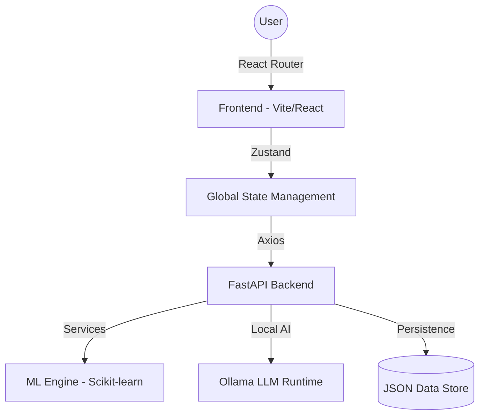

# 🏦 AUREXIS AI - Financial Intelligence Platform

<div align="center">


**Next-Generation AI-powered financial intelligence platform with real-time analytics, risk assessment, and local LLM integration.**

[Features](#-key-features) • [Installation](#-installation--setup) • [Ollama Setup](#-ollama-ai-integration) • [Users](#-authorized-users) • [Architecture](#-architecture)

</div>

---

## 🎯 Overview

**AUREXIS AI** is a comprehensive financial decision support system designed to provide institutional-grade insights. By combining advanced machine learning models with a premium, glassmorphic UI, AUREXIS transforms raw financial data into actionable intelligence.

### why AUREXIS AI?

- **🤖 Local Intelligence**: Privacy-first AI interactions using local LLMs via Ollama.
- **📊 Financial Health DNA**: Dynamic scoring system based on 15+ financial vectors.
- **🔮 Predictive Roadmap**: ML-driven goal achievement forecasting and wealth timelines.
- **🎨 Elite UI/UX**: 3D mouse-reactive components, glassmorphism, and premium micro-animations.
- **💱 Global Ready**: Integrated multi-currency engine (INR/USD) with real-time formatting.

---

## ✨ Key Features

### 💎 Intelligence & Analytics
- 📈 **Multi-Dimensional Health Scoring** - Comprehensive assessment of savings, debt, and risk.
- 🎯 **Goal Achievement Roadmap** - Visual timeline for financial milestones and vision boards.
- ⚠️ **Smart Risk Indicators** - Real-time auditing of financial vulnerabilities.
- 🧠 **AI Smart Tips** - Context-aware financial micro-advice generated in real-time.

### 🔮 Predictive Modeling
- 📉 **ML Forecasting** - 6-month expense and income projections using ensemble models.
- 🎲 **Scenario Simulation** - "What-if" modeling for major financial decisions.
- 🛡️ **Fraud & Risk Detection** - AI-powered transaction auditing.

### 🎨 Premium Experience
- 💬 **Floating AI Chat** - Persistent financial advisor available on any page.
- 📄 **Export Suite** - Institutional-quality PDF financial reports.
- 💱 **Dynamic Currency Toggle** - Instant switching between INR (₹) and USD ($).
- 🖱 **Physics-Based UI** - Mouse-reactive cards and 3D parallax effects.

---

## 🚀 Installation & Setup

### 1. Prerequisites
- **Python 3.11+**
- **Node.js 18+**
- **Ollama** (for AI features)

### 2. Ollama AI Integration
AUREXIS AI uses local LLMs for data privacy.
1. Download Ollama from [ollama.com](https://ollama.com).
2. Install and run the Ollama service.
3. Pull the required models:
   ```bash
   ollama pull deepseek-v2
   ```

### 3. Backend Setup
```bash
cd backend
python -m venv venv
source venv/Scripts/activate  # Mac/Linux: source venv/bin/activate
pip install -r requirements.txt

# Create environment file
cp .env.example .env
```

### 4. Frontend Setup
```bash
cd frontend
npm install
```

### 5. Running the Application
**Terminal 1 (Backend):**
```bash
cd backend
python server.py
```
**Terminal 2 (Frontend):**
```bash
cd frontend
npm run dev
```

---

## 👥 Authorized Users

The platform is pre-configured with 12 institutional user profiles:

| User ID | Name | Role |
| :--- | :--- | :--- |
| **1010101010** | SK | Super User / Administrator |
| **1111111111** | Imayavarman | Senior Consultant |
| **1212121212** | Srivarshan | Business Executive |
| **1313131313** | Rahulprasath | Software Architect |
| **1414141414** | Magudesh | Financial Analyst |
| **2020202020** | Deepak | Product Manager |
| **2121212121** | Mani | Operations Head |
| **2222222222** | Dineshkumar | Research Scientist |
| **2525252525** | Avinash | UX Lead |
| **3333333333** | Kumar | Strategy Director |
| **4444444444** | Hari | Security Engineer |
| **5555555555** | Janakrishnan | Data Engineer |

*All users are part of the AUREXIS AI financial ecosystem.*

---

## 🏗 Architecture



---

## 📄 License

This project is licensed under the MIT License - see the [LICENSE](LICENSE) file for details.

---

<div align="center">

**AUREXIS AI** - Built for the future of Personal Finance.

[](https://github.com/SenthilkumaranPSK)

</div>
